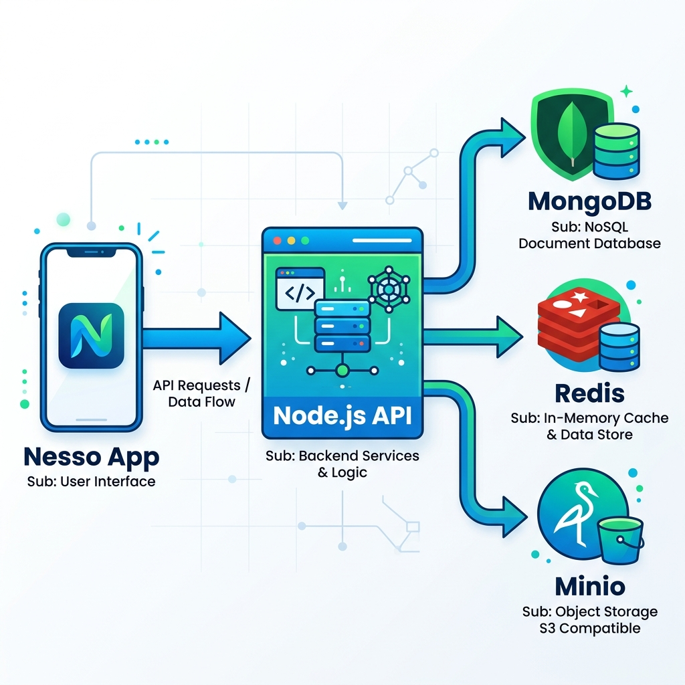
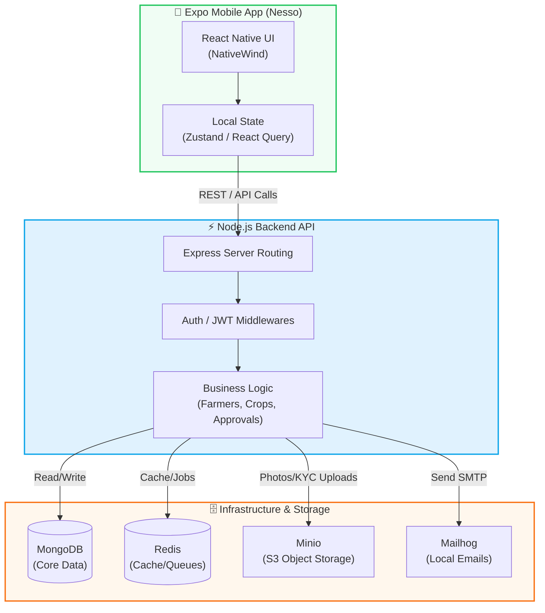

# Nesso System Architecture

**Modern Data Flow & Technology Stack**

---

## 🏗️ Architecture Infographic

Here is the high-definition, light-themed system design infographic illustrating our stack and data flow:

  

---

## ⚙️ Technologies Used

- **Frontend / Mobile**: Expo, React Native, TypeScript, NativeWind
- **Backend / API**: Node.js, Express (or similar), TypeScript
- **Database**: MongoDB (Primary Database)
- **Caching & Queues**: Redis
- **Object Storage**: Minio (S3-compatible storage for KYC docs, images, etc.)
- **Local Dev Tools**: Mailhog (Email Testing), Docker (Containerization)

---

## 🔄 Technical Data Flow (End-to-End)

While the infographic above provides a high-level conceptual vision, the exact technical end-to-end flow for Nesso is mapped out below:

### Core Business Flows:
1. **Onboarding & KYC**: Farmers register via the app. ID proofs and Farm photos are uploaded directly to **Minio**. The profile data sits in **MongoDB** with an `approvalStatus: pending`.
2. **Offline-First Capabilities**: Mobile state is managed via **Zustand** and **React Query**, meaning critical actions can be queued locally and synced when online.
3. **Data Aggregation**: The Node.js API processes complex aggregates (e.g., total crop yields, input usage) fetching from MongoDB collections (`farms`, `crops`, `activities`).

 

  <i>Maintained by Nesso Engineering Team</i>

